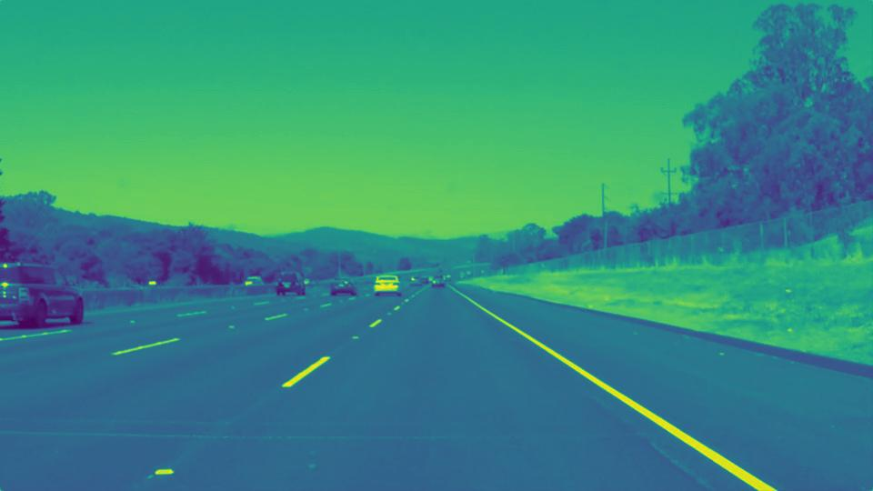
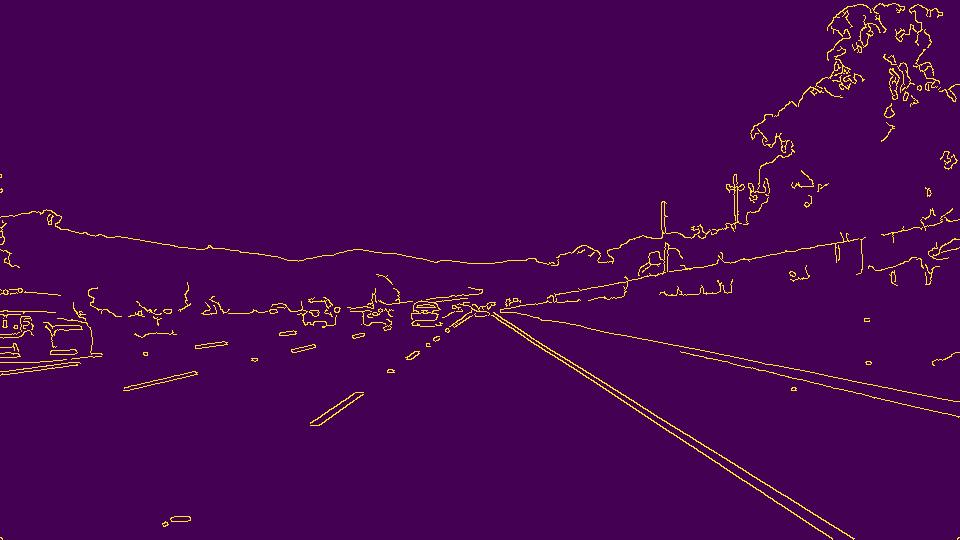
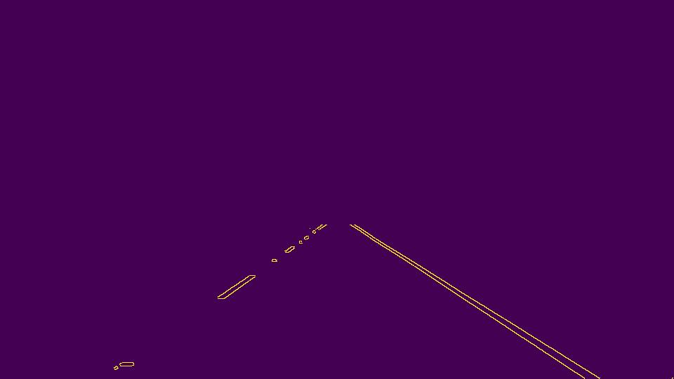
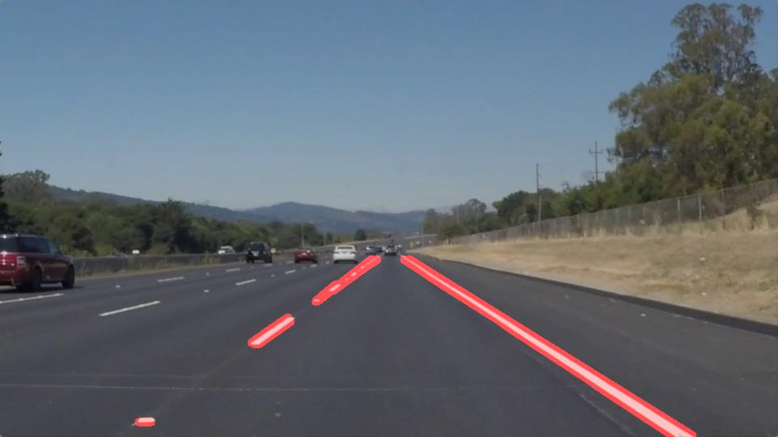
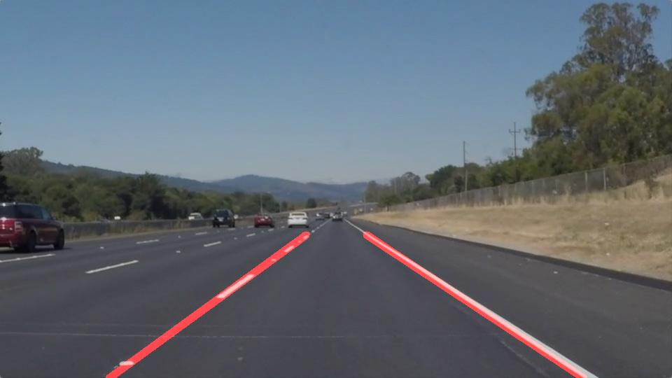

# **Finding Lane Lines on the Road** 

### Reflection

### 1. Describe your pipeline. As part of the description, explain how you modified the draw_lines() function.

The following steps were followed in developing the pipeline
1. Convert RGB image to greyscale with the aid of helper function greyscale().

2. Apply gaussian blur to greyscale at kernel size 5 using gaussian_blur()and perform canny edge detection with minimum threshold 40 and maximum threshold 120 with canny().

    
3.Define a polygon of interest to remove or ignore undesired portions of the image with help of region_of_interest()
    
4.Retrieve Hough lines and impose lines to the original image 
hough_lines() - to convert the lines from canny egde to hough lines
draw_lines() - to draw lined from canny edge points.
weighted_img() - to superimpose the results on the actual image
    
 
 The following were the parameters considered for the above image
 kernel_size = 5, 
 low_threshold = 50, 
 high_threshold = 150, 
 vertices = (75,imshape(0)),(450, 320), (540, 320), (imshape(1),imshape(0)]----square brackets after imshape, 
 rho = 1, 
 theta = np.pi/180, 
 threshold = 2, 
 min_line_length = 15, 
 max_line_gap = 15

In order to draw a single line on the left and right lanes, I modified the draw_lines() function by making the following assumptions

1. A mid point for image is assumed around x = 540, all points which lie to left of the point are considered to be contributing for left lane and points which lie right to this midpoint are contributing to right lane.

2. The left lane line is considered to have a positive slope and right lane line is considered to have negative slope.

Based on these assumptions all the points detected in canny edge after masking are filtered by introducing a conditional of the assumptions in draw_lines() into two lines, which get imposed on left and right lanes of the image.
    

The following were the parameters considered for the above image
 kernel_size = 5, 
 low_threshold = 50, 
 high_threshold = 150, 
 vertices = (75,imshape(0)),(450, 320), (540, 320), (imshape(1),imshape(0)]----square brackets after imshape, 
 rho = 4, 
 theta = np.pi/180, 
 threshold = 50, 
 min_line_length = 25, 
 max_line_gap = 5
 
The same parameters were used in testing the videos 

solidWhiteRight.mp4

solidYellowLeft.mp4

### 2. Identify potential shortcomings with your current pipeline

The following would the potential shortcomings to current pipeline.

1. This pipeline would fail if the road is not straight as this pipeline identifies only straight line lanes and extrapolates only lines.
2. This pipeline is dependent on position of the camera as one of the assumptions is based on the midpoint of the assumption which is dependent on the location of the camera.
3. The region of interest is fixed at a height considering only straight roads and is not flexible thereby leading to complete failure at curves.
4. Several factors like night time, fog, intensity of light,etc. might hamper the quality of the image thereby leading to dynamic changes in the lane lines in each frame of the video.
5. This pipeline needs further smoothening in lane line identification  with the video in examples.

### 3. Suggest possible improvements to your pipeline

The following improvements could be done to the current pipeline

1. Although tracing pixels in a image is potentially a good idea, we are solely dependent on camera in this case whose failure or malfunctioning might hamper the pipeline, therefore we will need additional inputs like heat signatures,etc. to better aid the pipeline.
2. Adapting to the road structure i.e. in case of curvatures is a challenge, this could be done by making region of the interest dynamic and moving away from lines to curves in such situation.
